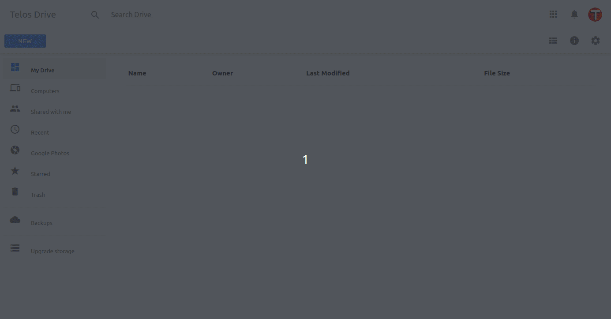

# GDrive

Welcome to my Google Drive Clone.

Please Tag this project with a start 🌟

## Preview

## Checklist Features
- API
  - [x] It should list downloaded files
  - [x] It must stream files and save them in disk
  - [x] It should notify about progress of storing files to disk
  - [x] It must allow uploading of files in image, video or audio format
  - [x] It must reach 100% code coverage in tests
- APP
  - [x] Should list downloaded files
  - [x] Should allow uploading of files of any size
  - [x] Must have upload function via button
  - [x] Should display upload progress
  - [x] Must have drag and drop upload function

## FAQ
- `NODE_OPTIONS` is not a system recognized command, wath to do?

If you are on Windows, the way to create environment variables is different. You must use the word `set` before the command.

Example: `"test": "set NODE_OPTIONS=--experimental-vm-modules && npx jest --runInBand",`

- SSL certificate is invalid, what to do?

This error happens because I generated a certificate linked to the user of my machine.

You can click on proceed in the browser and use the invalid certificate and the project will continue working, but if you wnat to generate your own, I wrote the step by step in [./certificates](https://github.com/Teloschet/gdrive/tree/main/certificates)

- I ran `npm test` but nothing happens, what to do?

Check your Node.js version. I used version 16.8. Go to [node.js website](https://nodejs.org) and download the latest version.
